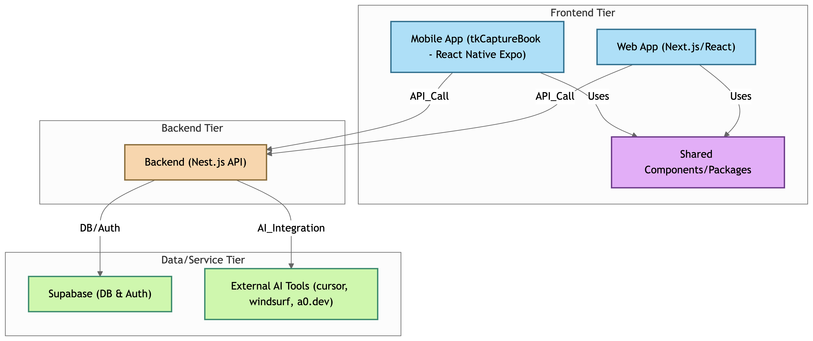

# tkCapture



## [0] Common

- development tool with AI

  - cursor
  - windsurf
  - [a0.dev](https://a0.dev/)

- backend
  - supabase
  - nest.js

## [1] tkCaptureBook

### Tech stack

- app
  - react native expo
  - supabase
  - jotai
  - tailwind css
  - shadcn/ui

## EAS Build

### iOS

```bash
> build:ios
# eas build --platform ios --profile production
```

### Android

```bash
> build:android
# eas build --platform android --profile preview
```
