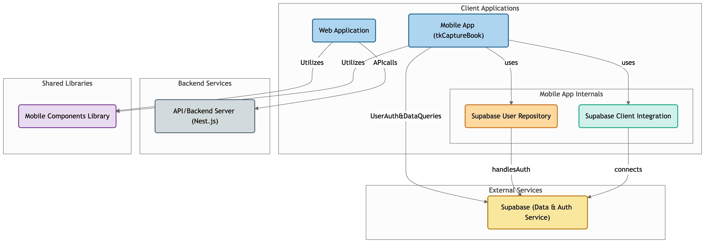

# tkCapture

tkCapture is a mobile application suite focused on AI-powered image capture and analysis.

- (ING) tkCaptureBook : Capture book pages, analyze them with AI, discuss insights, and beautifully share your reading experience.
- (TO-DO) tkCaptureSomething ...



## Screenshot


## [1] tkCaptureBook

### Tech stack

- app

  - react native expo
  - supabase
  - jotai
  - tailwind css
  - shadcn/ui

- backend

  - supabase
  - nest.js

- development tool with AI

  - cursor
  - windsurf
  - [a0.dev](https://a0.dev/)

## EAS Build

### iOS

```bash
> yarn build:ios
# eas build --platform ios --profile production
```

### Android

```bash
> yarn build:android
# eas build --platform android --profile preview
```
