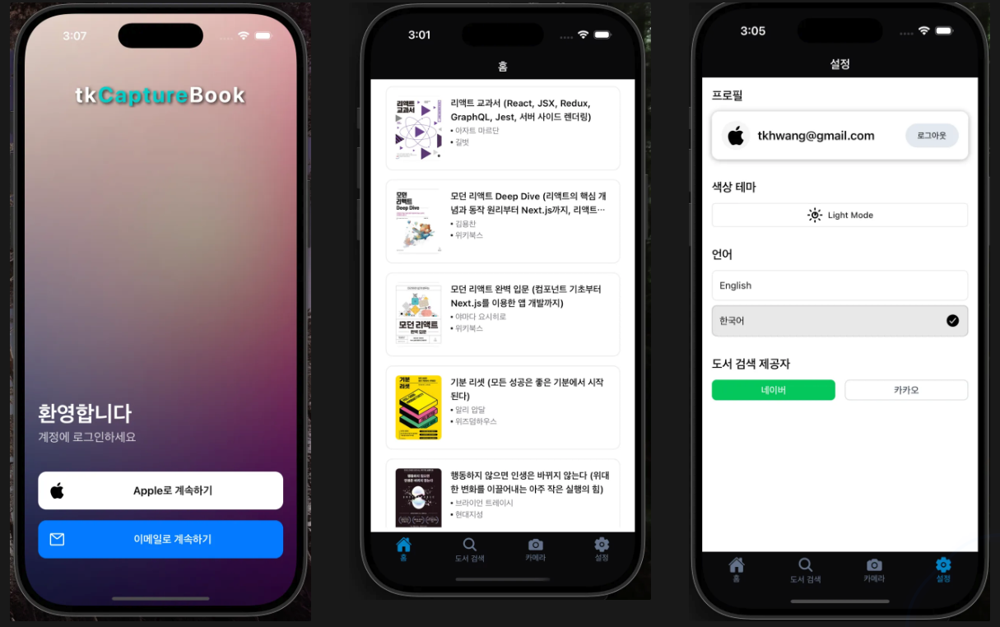

# tkCapture

tkCapture is a mobile application suite focused on AI-powered image capture and analysis.

- (ING) tkCaptureBook : Capture book pages, analyze them with AI, discuss insights, and beautifully share your reading experience.
- (TO-DO) tkCaptureSomething ...


## Screenshot

### Book search

- search -> register


### Chat with LLM

- registered book list in home
- [TODO] Talk about book using LLM
- [TODO] book capture sentence using camera
- [TODO] share book sentence with book meta information


### Login/Setting


<!--  -->

<!--  -->

## [1] tkCaptureBook

### Tech stack

- app

  - react native expo
  - supabase
  - jotai
  - tailwind css
  - shadcn/ui

- backend

  - supabase
  - nest.js

- development tool with AI

  - cursor
  - windsurf
  - [a0.dev](https://a0.dev/)

## EAS Build/Submit/Update

### EAS Build

#### iOS

```bash
> yarn build:ios
# eas build --platform ios --profile production
```

#### Android

```bash
> yarn build:android
# eas build --platform android --profile preview
```

### EAS Submit

```bash
eas submit
```

### EAS Update

### iOS

```bash
eas update --branch production --message "[X.X.X] chnageNote"
```

### Android

```bash
eas update --branch preview --message "[X.X.X] chnageNote"
```
